#### Exploratory Data Analysis files

```r
charity <- read.csv("./charity.csv")
str(charity)
```

'data.frame':    8009 obs. of  24 variables:  
$ ID  : int  1 2 3 4 5 6 7 8 9 10 ...  
$ reg1: int  0 0 0 0 0 0 0 0 0 0 ...  
$ reg2: int  0 0 0 0 0 1 0 0 0 0 ...  
$ reg3: int  1 1 1 0 1 0 0 0 1 0 ...  
$ reg4: int  0 0 0 0 0 0 0 0 0 0 ...  
$ home: int  1 1 1 1 1 1 1 1 1 1 ...  
$ chld: int  1 2 1 1 0 1 3 3 2 3 ...  
$ hinc: int  4 4 5 4 4 5 4 2 3 4 ...  
$ genf: int  1 0 1 0 1 0 0 0 1 1 ...  
$ wrat: int  8 8 8 8 4 9 8 5 5 7 ...  
$ avhv: int  302 262 303 317 295 114 145 165 194 200 ...  
$ incm: int  76 130 61 121 39 17 39 34 112 38 ...  
$ inca: int  82 130 90 121 71 25 42 35 112 58 ...  
$ plow: int  0 1 6 0 14 44 10 19 0 5 ...  
$ npro: int  20 95 64 51 85 83 50 11 75 42 ...  
$ tgif: int  81 156 86 56 132 131 74 41 160 63 ...  
$ lgif: int  81 16 15 18 15 5 6 4 28 12 ...  
$ rgif: int  19 17 10 7 10 3 5 2 34 10 ...  
$ tdon: int  17 19 22 14 10 13 22 20 14 19 ...  
$ tlag: int  6 3 8 7 6 4 3 7 4 3 ...  
$ agif: num  21.05 13.26 17.37 9.59 12.07 ...  
$ donr: int  0 1 NA NA 1 1 0 0 NA 0 ...  
$ damt: int  0 15 NA NA 17 12 0 0 NA 0 ...  
$ part: Factor w/ 3 levels "test","train",..: 2 2 1 1 3 2 3 3 1 2   

### home  
(0 = not a homeowner, 1 = homeowner)  
```r
##    0    1 
## 1069 6940
```
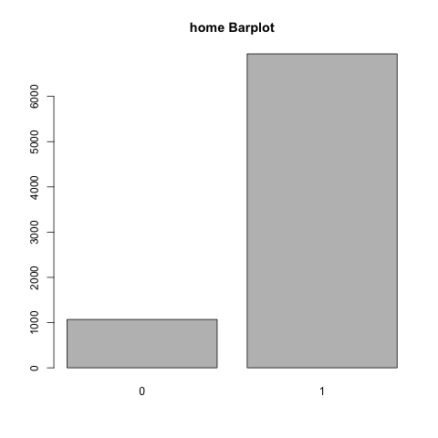


### chld  
Number of children  
```r
##    0    1    2    3    4    5 
## 2401  823 2494 1447  619  225
```


### hinc  
Household income (7 categories)  
```r
##    1    2    3    4    5    6    7 
##  522 1021  822 3462 1152  544  486
```
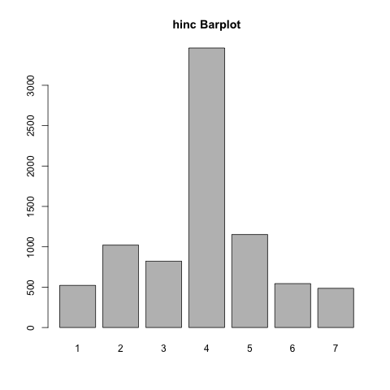

### genf  
Gender (0 = Male, 1 = Female)  
```r
##    0    1 
## 3161 4848
```
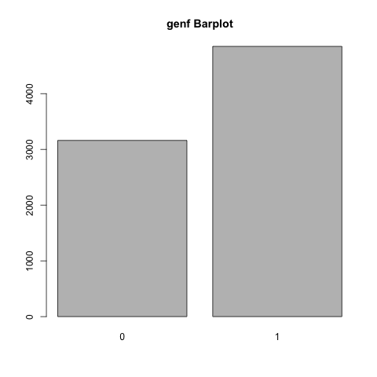

### wrat  
Wealth Rating (Wealth rating uses median family income and population statistics from each area to index relative wealth within each state. The segments are denoted 0-9, with 9 being the highest wealth group and 0 being the lowest.)  
```r
##    0    1    2    3    4    5    6    7    8    9 
##  222  198  250  333  443  408  516  480 3021 2138
```
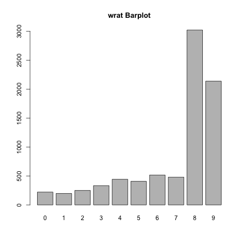


### avhv  
Average Home Value in potential donor's neighborhood in $ thousands  
```r
    Min   LH  Med   UH  Max
##  48   133  169  217  710
```
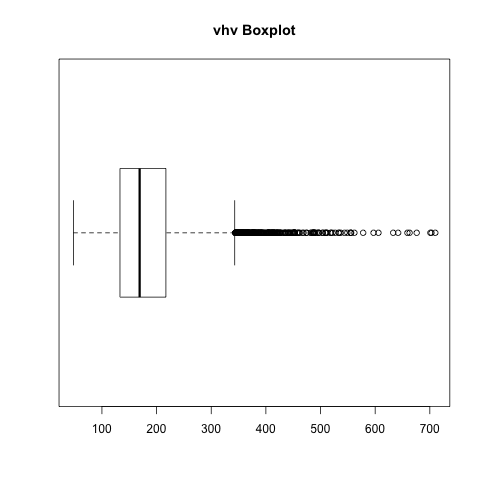
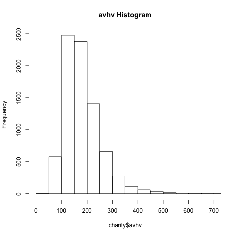

### incm  
Median Family Income in potential donor's neighborhood in $ thousands  
```r
   Min   LH   Med   UH   Max
##  48  133   169  217   710
```
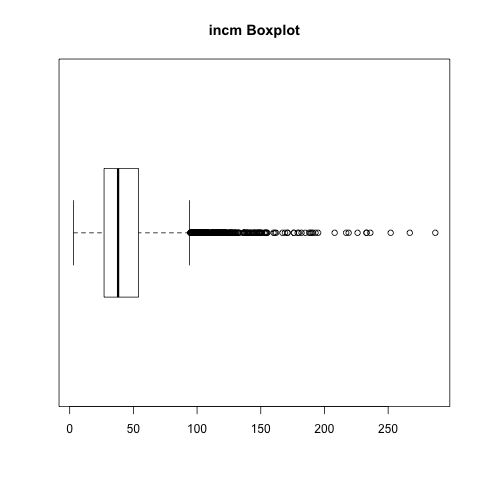
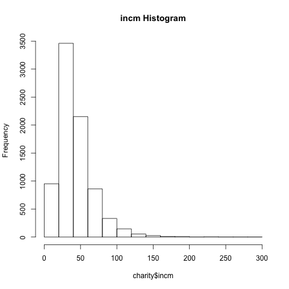

### inca  
Average Family Income in potential donor's neighborhood in $ thousands  
```r
        Min   LH   Med   UH   Max
## [1]   12   40    51   68   305
```
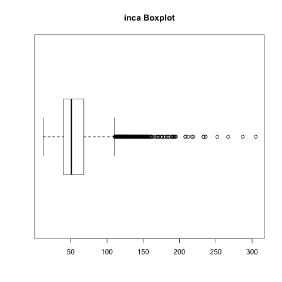
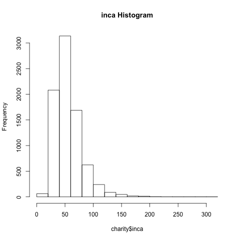

### plow  
Percent categorized as “low income” in potential donor's neighborhood  
```r
        Min   LH   Med   UH   Max
## [1]    0    4    10   21    87
```
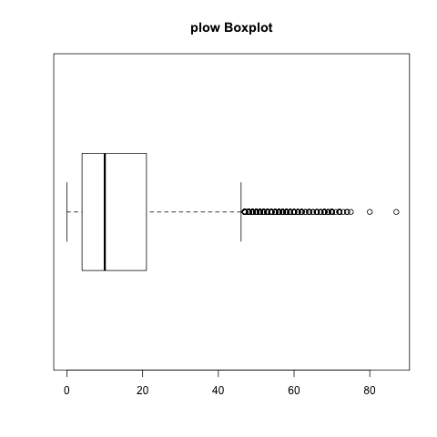
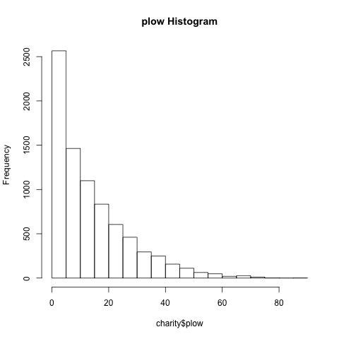

### npro  
Lifetime number of promotions received to date  
```r
         Min   LH   Med   UH   Max
## [1]     2   36    58   82   164
```
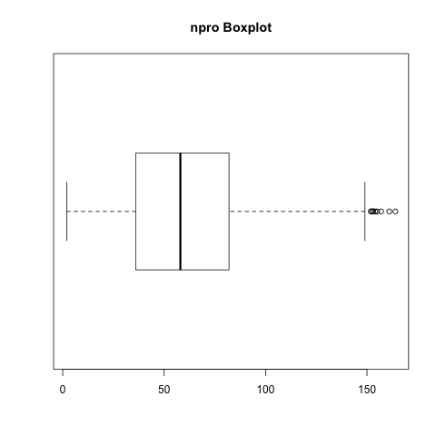
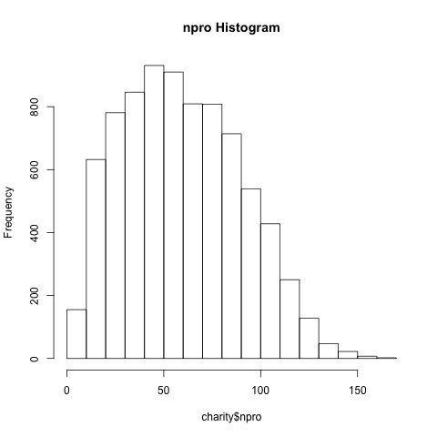

### tgif  
Dollar amount of lifetime gifts to date  
```r
         Min   LH   Med   UH   Max
## [1]     2   36    58   82   164
```
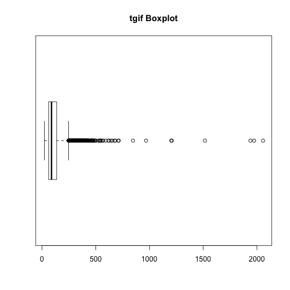
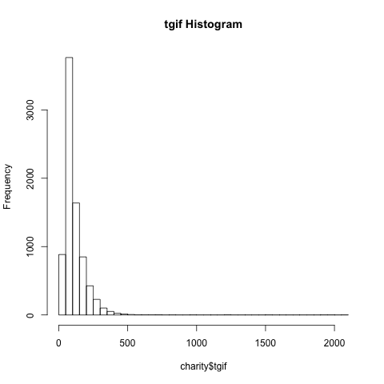

### lgif  
Dollar amount of largest gift to date  
```r
         Min   LH   Med   UH   Max
## [1]     3   10    16   25   681
```
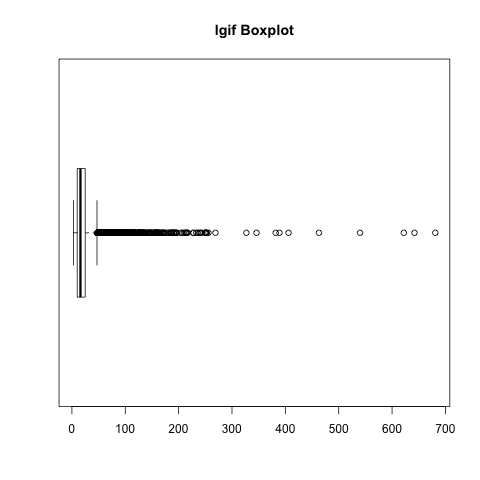
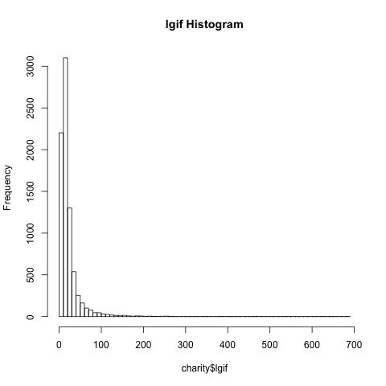

### rgif  
Dollar amount of most recent gift  
```r
        Min   LH   Med   UH   Max
## [1]    1    7    12   20   173
```
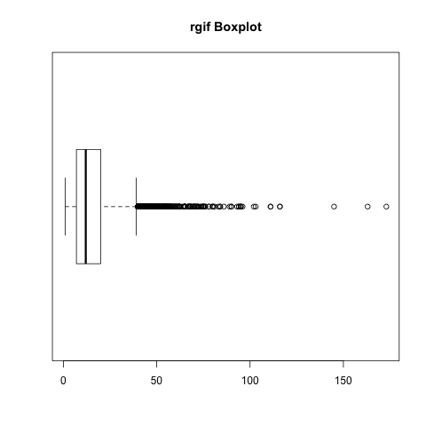
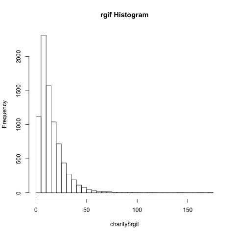

### tdon  
Number of months since last donation  
```r
        Min   LH   Med   UH   Max
## [1]    5   15    18   22    40
```
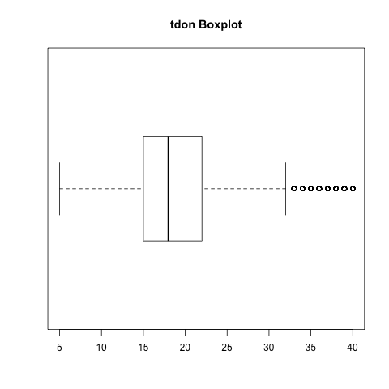
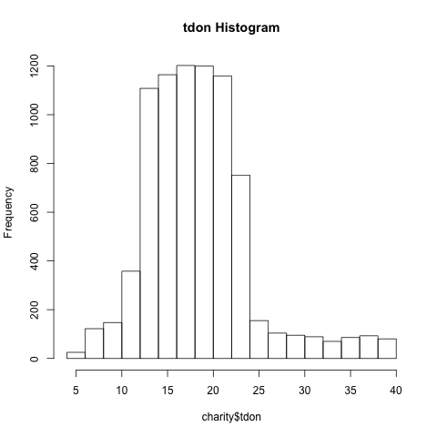

### tlag  
Number of months between first and second gift  
```r
        Min   LH   Med   UH   Max
## [1]    1    4    5     7    34
```
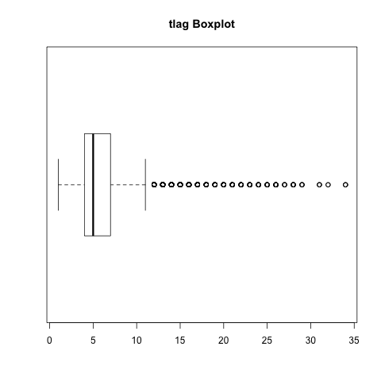
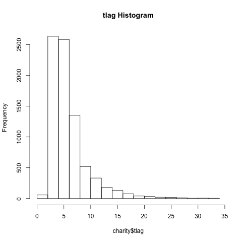

### agif  
Average dollar amount of gifts to date  
```r
         Min    LH    Med    UH    Max
## [1]  1.29   6.97  10.23 14.80  72.27
```
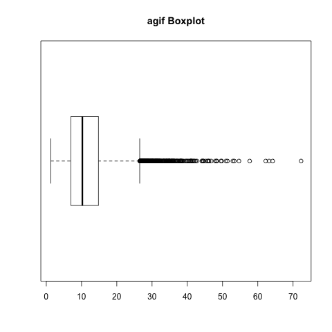
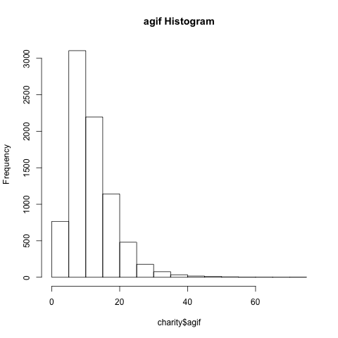

### DONR    
Classification Response Variable (0 = Non-Donor, 1 = Donor)
```r
##    0    1 
## 3008 2994
```
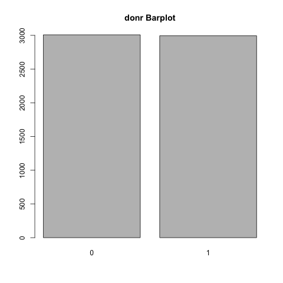

### DAMT    
Prediction Response Variable (Donation Amount in $)   
```r
        Min   LH   Med   UH   Max
## [1]    0    0     0   14    27
```
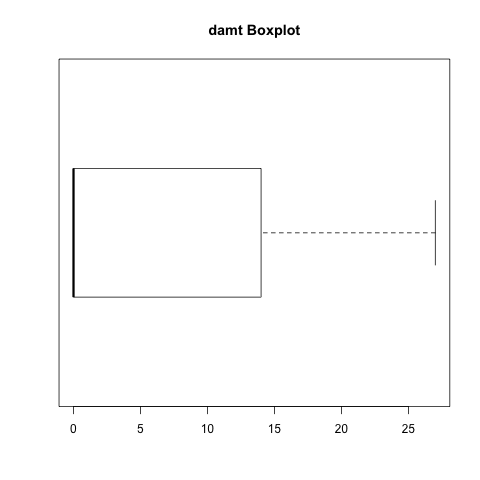
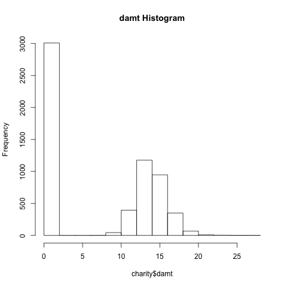
