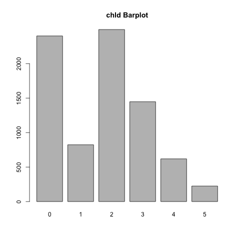

#### Exploratory Data Analysis files

```r
charity <- read.csv("./charity.csv")
str(charity)
```

'data.frame':    8009 obs. of  24 variables:
$ ID  : int  1 2 3 4 5 6 7 8 9 10 ...
$ reg1: int  0 0 0 0 0 0 0 0 0 0 ...
$ reg2: int  0 0 0 0 0 1 0 0 0 0 ...
$ reg3: int  1 1 1 0 1 0 0 0 1 0 ...
$ reg4: int  0 0 0 0 0 0 0 0 0 0 ...
$ home: int  1 1 1 1 1 1 1 1 1 1 ...
$ chld: int  1 2 1 1 0 1 3 3 2 3 ...
$ hinc: int  4 4 5 4 4 5 4 2 3 4 ...
$ genf: int  1 0 1 0 1 0 0 0 1 1 ...
$ wrat: int  8 8 8 8 4 9 8 5 5 7 ...
$ avhv: int  302 262 303 317 295 114 145 165 194 200 ...
$ incm: int  76 130 61 121 39 17 39 34 112 38 ...
$ inca: int  82 130 90 121 71 25 42 35 112 58 ...
$ plow: int  0 1 6 0 14 44 10 19 0 5 ...
$ npro: int  20 95 64 51 85 83 50 11 75 42 ...
$ tgif: int  81 156 86 56 132 131 74 41 160 63 ...
$ lgif: int  81 16 15 18 15 5 6 4 28 12 ...
$ rgif: int  19 17 10 7 10 3 5 2 34 10 ...
$ tdon: int  17 19 22 14 10 13 22 20 14 19 ...
$ tlag: int  6 3 8 7 6 4 3 7 4 3 ...
$ agif: num  21.05 13.26 17.37 9.59 12.07 ...
$ donr: int  0 1 NA NA 1 1 0 0 NA 0 ...
$ damt: int  0 15 NA NA 17 12 0 0 NA 0 ...
$ part: Factor w/ 3 levels "test","train",..: 2 2 1 1 3 2 3 3 1 2 

#### home  
(0 = not a homeowner, 1 = homeowner)  
```{r}
counts1 <- table(charity$home)
counts1
barplot(counts1, main = "home Barplot")
dev.copy(png,'./EDA/home_bar.png')
dev.off()
```


#### chld  
Number of children  
```{r}
counts2 <- table(charity$chld)
counts2
barplot(counts2, main = "chld Barplot")
dev.copy(png,'./EDA/chld_bar.png')
dev.off()
```


#### hinc  
Household income (7 categories)  
```{r}
counts3 <- table(charity$hinc)
counts3
barplot(counts3, main = "hinc Barplot")
dev.copy(png,'./EDA/hinc_bar.png')
dev.off()
```


#### genf  
Gender (0 = Male, 1 = Female)  
```{r}
counts4 <- table(charity$genf)
counts4
barplot(counts4, main = "genf Barplot")
dev.copy(png,'./EDA/genf_bar.png')
dev.off()
```


#### wrat  
Wealth Rating (Wealth rating uses median family income and population statistics from each area to index relative wealth within each state. The segments are denoted 0-9, with 9 being the highest wealth group and 0 being the lowest.)  
```{r}
counts5 <- table(charity$wrat)
counts5
barplot(counts5, main = "wrat Barplot")
dev.copy(png,'./EDA/wrat_bar.png')
dev.off()
```


#### avhv  
Average Home Value in potential donor's neighborhood in $ thousands  
```{r}
fivenum(charity$avhv)
boxplot(charity$avhv, main = "vhv Boxplot", horizontal = TRUE)
dev.copy(png,'./EDA/avhv_box.png')
dev.off()
hist(charity$avhv, main = "avhv Histogram", xlim = c(0, 700))
dev.copy(png,'./EDA/avhv_hist.png')
dev.off()
```


#### incm  
Median Family Income in potential donor's neighborhood in $ thousands  
```{r}
fivenum(charity$incm)
boxplot(charity$incm, main = "incm Boxplot", horizontal = TRUE)
dev.copy(png,'./EDA/incm_box.png')
dev.off()
hist(charity$incm, main = "incm Histogram")
dev.copy(png,'./EDA/incm_hist.png')
dev.off()
```


#### inca  
Average Family Income in potential donor's neighborhood in $ thousands  
```{r}
fivenum(charity$inca)
boxplot(charity$inca, main = "inca Boxplot", horizontal = TRUE)
dev.copy(png,'./EDA/inca_box.png')
dev.off()
hist(charity$inca, main = "inca Histogram")
dev.copy(png,'./EDA/inca_hist.png')
dev.off()
```


#### plow  
Percent categorized as “low income” in potential donor's neighborhood  
```{r}
fivenum(charity$plow)
boxplot(charity$plow, main = "plow Boxplot", horizontal = TRUE)
dev.copy(png,'./EDA/plow_box.png')
dev.off()
hist(charity$plow, main = "plow Histogram")
dev.copy(png,'./EDA/plow_hist.png')
dev.off()
```


#### npro  
Lifetime number of promotions received to date  
```{r}
fivenum(charity$npro)
boxplot(charity$npro, main = "npro Boxplot", horizontal = TRUE)
dev.copy(png,'./EDA/npro_box.png')
dev.off()
hist(charity$npro, main = "npro Histogram")
dev.copy(png,'./EDA/npro_hist.png')
dev.off()
```


#### tgif  
Dollar amount of lifetime gifts to date  
```{r}
fivenum(charity$tgif)
boxplot(charity$tgif, main = "tgif Boxplot", horizontal = TRUE)
dev.copy(png,'./EDA/tgif_box.png')
dev.off()
hist(charity$tgif, main = "tgif Histogram", breaks = 50)
dev.copy(png,'./EDA/tgif_hist.png')
dev.off()
```


#### lgif  
Dollar amount of largest gift to date  
```{r}
fivenum(charity$lgif)
boxplot(charity$lgif, main = "lgif Boxplot", horizontal = TRUE)
dev.copy(png,'./EDA/lgif_box.png')
dev.off()
hist(charity$lgif, main = "lgif Histogram", breaks = 50)
dev.copy(png,'./EDA/gif_hist.png')
dev.off()
```


#### rgif  
Dollar amount of most recent gift  
```{r}
fivenum(charity$rgif)
boxplot(charity$rgif, main = "rgif Boxplot", horizontal = TRUE)
dev.copy(png,'./EDA/rgif_box.png')
dev.off()
hist(charity$rgif, main = "rgif Histogram", breaks = 50)
dev.copy(png,'./EDA/rgif_hist.png')
dev.off()
```


#### tdon  
Number of months since last donation  
```{r}
fivenum(charity$tdon)
boxplot(charity$tdon, main = "tdon Boxplot", horizontal = TRUE)
dev.copy(png,'./EDA/tdon_box.png')
dev.off()
hist(charity$tdon, main = "tdon Histogram")
dev.copy(png,'./EDA/tdon_hist.png')
dev.off()
```


#### tlag  
Number of months between first and second gift  
```{r}
fivenum(charity$tlag)
boxplot(charity$tlag, main = "tlag Boxplot", horizontal = TRUE)
dev.copy(png,'./EDA/tlag_box.png')
dev.off()
hist(charity$tlag, main = "tlag Histogram")
dev.copy(png,'./EDA/tlag_hist.png')
dev.off()
```


#### agif  
Average dollar amount of gifts to date  
```{r}
fivenum(charity$agif)
boxplot(charity$agif, main = "agif Boxplot", horizontal = TRUE)
dev.copy(png,'./EDA/agif_box.png')
dev.off()
hist(charity$agif, main = "agif Histogram")
dev.copy(png,'./EDA/agif_hist.png')
dev.off()
```


#### DONR    
Classification Response Variable (0 = Non-Donor, 1 = Donor)
```{r}
counts6 <- table(charity$donr)
counts6
barplot(counts6, main = "donr Barplot")
dev.copy(png,'./EDA/donr_bar.png')
dev.off()
```


#### DAMT    
Prediction Response Variable (Donation Amount in $)   
```{r}
fivenum(charity$damt)
boxplot(charity$damt, main = "damt Boxplot", horizontal = TRUE)
dev.copy(png,'./EDA/damt_box.png')
dev.off()
hist(charity$damt, main = "damt Histogram")
dev.copy(png,'./EDA/damt_hist.png')
dev.off()
```


